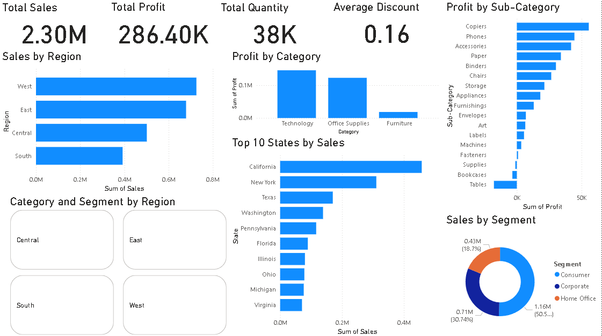

# Retail Sales Analytics Dashboard using SQL & Power BI

## Project Overview

This project analyzes retail sales data using SQL and Power BI to uncover business insights related to sales performance, profitability, customer segments, and regional trends.

---

## Business Problem

Retail businesses generate large amounts of transactional data. This dashboard helps stakeholders monitor sales performance, identify profitable categories, compare regional performance, and make data-driven decisions.

---

## Dataset

- Sample Superstore Dataset
- Source: Kaggle
- Records: 9,994
- Features: Sales, Profit, Quantity, Discount, Region, Category, Segment, State

---

## Technologies Used

- MySQL
- SQL
- Power BI
- Microsoft Excel

---

## Dashboard Features

- KPI Cards
- Total Sales
- Total Profit
- Total Quantity
- Average Discount
- Sales by Region
- Profit by Category
- Profit by Sub-Category
- Top 10 States by Sales
- Sales by Segment
- Interactive Region Filter

---

## Key Business Insights

- West region generated the highest sales.
- California recorded the highest sales among all states.
- Technology category produced the highest profit.
- Consumer segment contributed the largest share of revenue.
- Higher discounts reduced profit in several product categories.

---

## SQL Analysis

SQL was used to:

- Calculate total sales
- Calculate total profit
- Identify top-performing states
- Analyze category-wise profit
- Analyze regional sales
- Generate business insights

---

## Dashboard Preview

(Add screenshots below)

### Dashboard

### Sales by Region

### Profit by Category

---

## Folder Structure

Retail-Sales-Analytics-PowerBI/
│
├── dataset/
├── dashboard/
├── sql/
├── screenshots/
├── README.md
├── .gitignore
└── LICENSE

---

## Future Improvements

- Sales forecasting
- Customer segmentation
- Inventory analysis
- Interactive drill-through reports

---

## Author

Krishna Jaiswal

B.Tech Computer Science Engineering (2026)

Interested in Data Analytics, Data Science and Machine Learning.